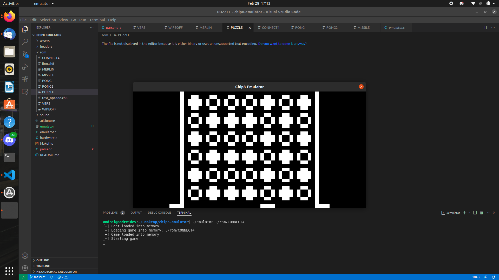
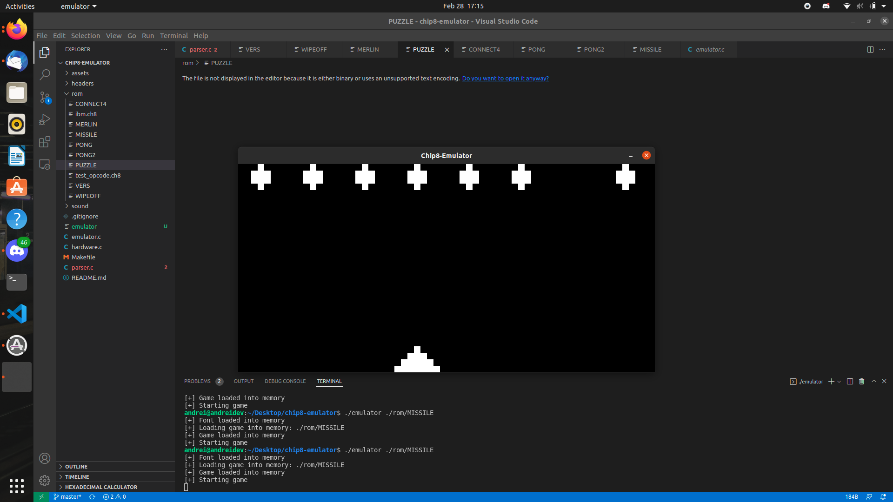
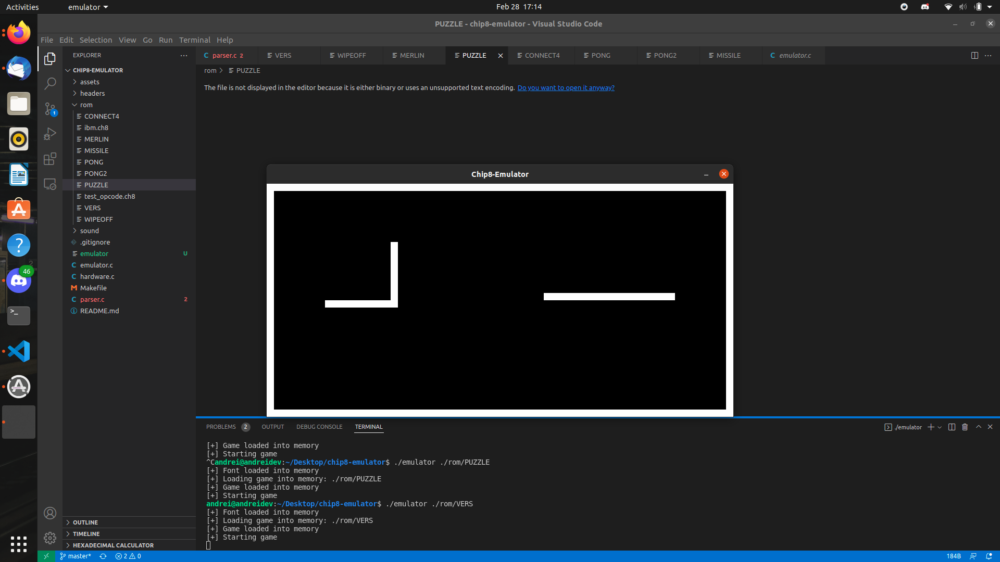
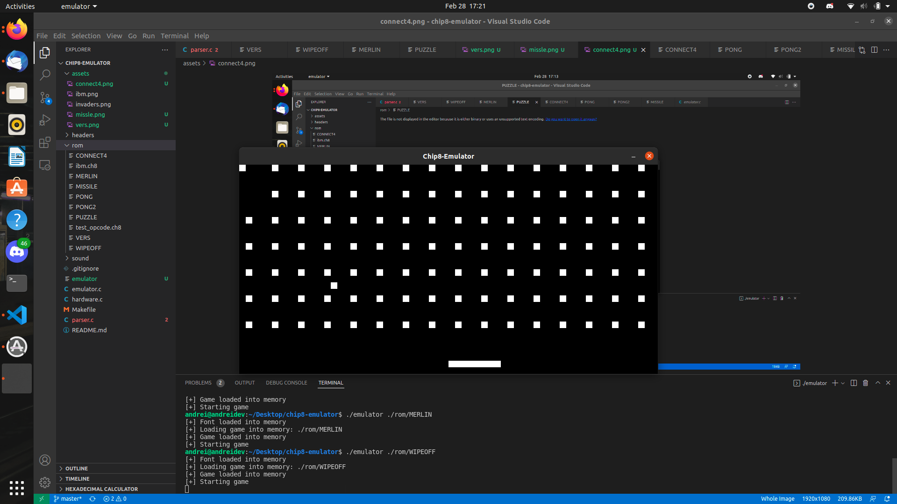

# Chip 8 emulator written in C

Supports alot of games. Check the rom folder.

Not all games out there will work since some games use a different implementation of the 8XY6, 8XYE, FX55 and FX65 Opcodes. I might add a feature in the future to toggle this however.


Dependencies: This project does depend on libsdl2 and on make so to intstall those run, using the package manager installed on the system, in my case I am using ubuntu so I am using apt.

```
sudo apt install libsdl2-dev
sudo apt install make 
```


To build it run the makefile on a Unix based system.

```
make emulator
```

To build a debug version which will have a symbol table loaded for gdb then run 
``` 
make debug=true debug
```

To clean the directory of object files run

```
make clean
```

Loading a game example(this would launch the missle game)
```
./emulator ./rom/MISSLE
```

Chip 8 Technical Documentation

```
http://devernay.free.fr/hacks/chip8/C8TECH10.HTM

```







